# Mini eCommerce

## Description
***
A UI based mobile app displaying screens from Sign In to Checkout. There is no backend connected to this app.
Bottom navigation bar was used instead of a drawer navigation for easier access to pages/screens. It included the home, categories and orders screens.
The home screen comprised of new arrivals section which is scrollable horizontally. The top categories is also scrollable horizontally.
The all products section is another section on the home screen. Products were displayed in grid format and scrollable vertically.
Categories and products were displayed on cards to make it more visible for the user to interact with.

The product detail screen displays a carousel for more than one product images.
The product detail screen included a quantity section for the user to specify the quantity of the product he/she is ordering. Also an option to add the product to your wishlist is being displayed beside the add to cart button. Add to cart and add to wishlist buttons were grouped together they have similar functionalities. 
The action bar menu on the product detail screen included the cart and share action menu. You can easily access the cart screen from the product detail page. The share action allows you to edit the price of product before sharing the product on various platforms such as Whatsapp.

The cart screen also allows to change the quantity before checking out. The total amount of items in the cart is being displayed at the bottom of the screen together with the checkout button. 

The checkout screen displayed all the options needed for checkout. The primary address is being displayed if it's been set already. The user has the option to change the delivery address. The list of products being ordered is being displayed beneath the delivery address when the drop down button is clicked. Payment options are displayed for the user to select to proceed with payment of the order.

The orders screen is part of the bottom navigation bar. It displays all placed orders. Every record displays the order number generated by the backend, the status of the order, the date and the number of items for that particular order. If an order is not completed, and track button is displayed for the user to ask about the status of his order on whatsapp.


## Technologies
***
A list of technologies used within the project:
* [Kotlin](https://kotlinlang.org/)
* [XML]

## Installation
*** 
```
$ git clone https://github.com/sammyBorborbor/mini_ecommerce.git
$ cd ../path/to/the/cloned/project
$ Open with Android Studio
$ Build and Run the project from Android Studio
```
## Screen Shots
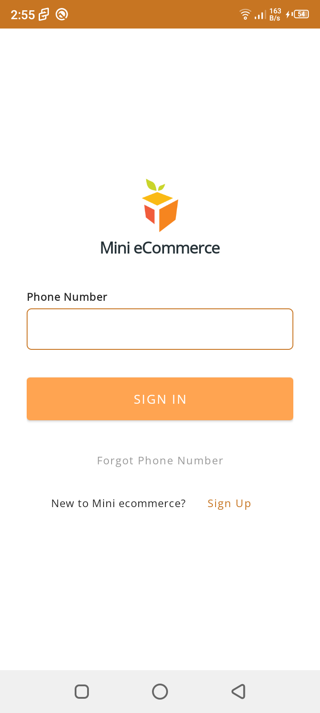
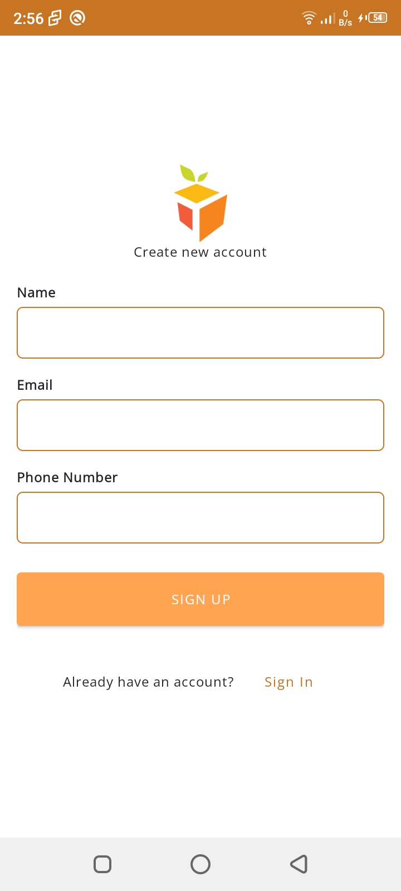
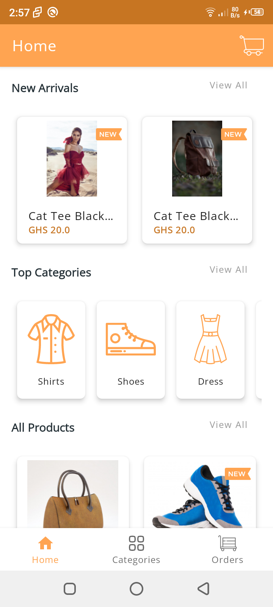
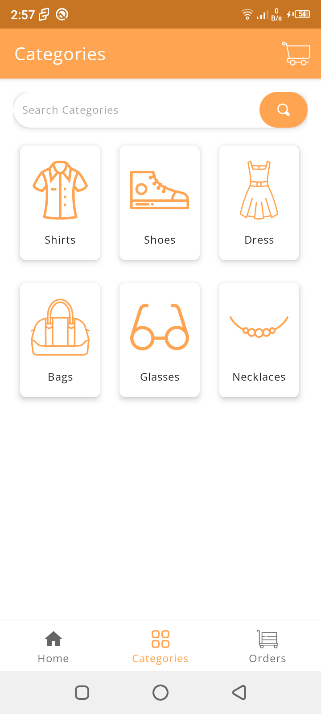
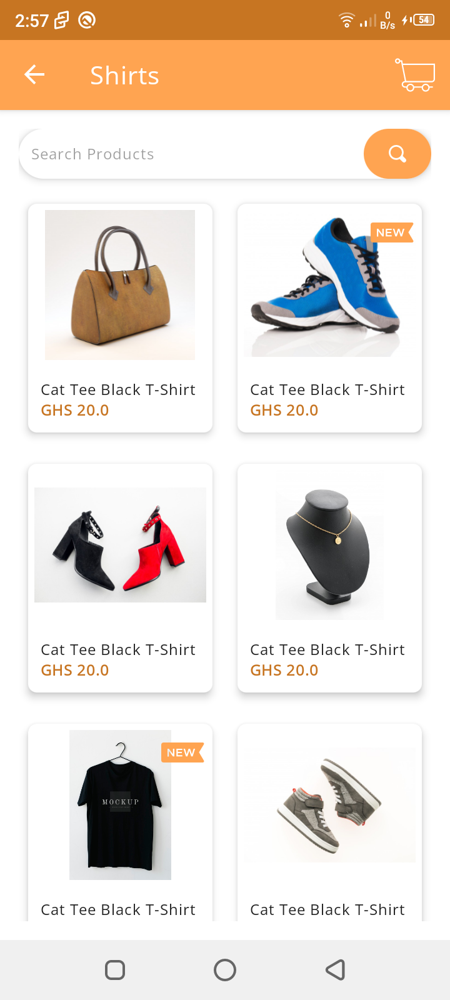
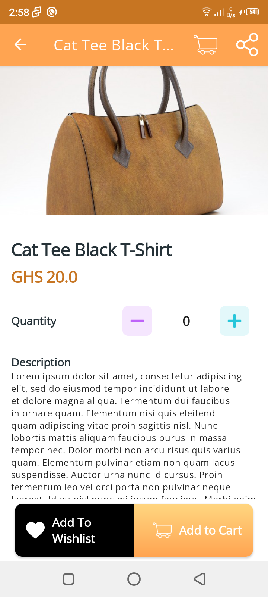
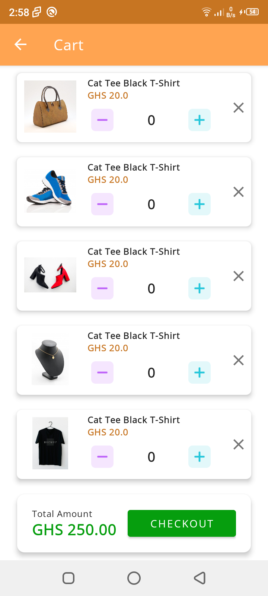
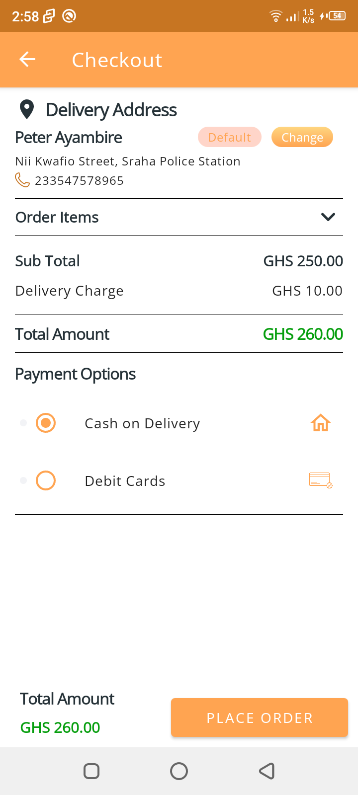
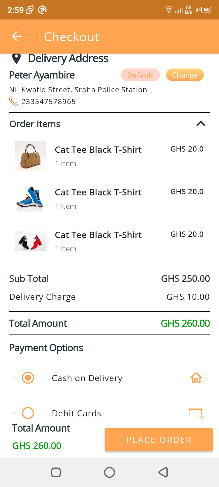
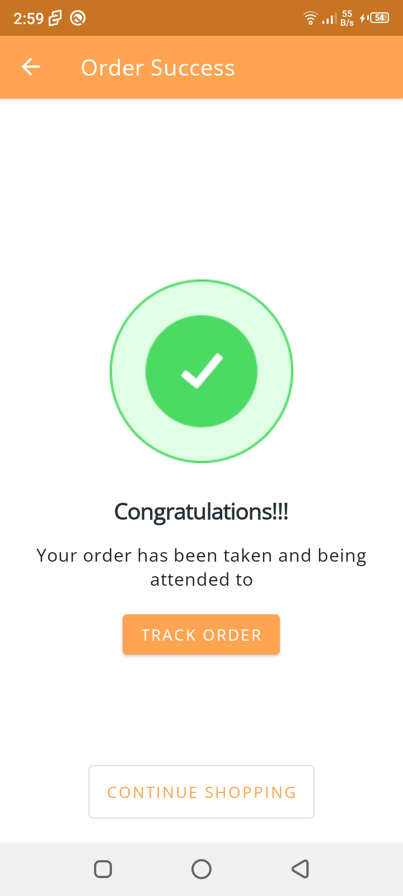
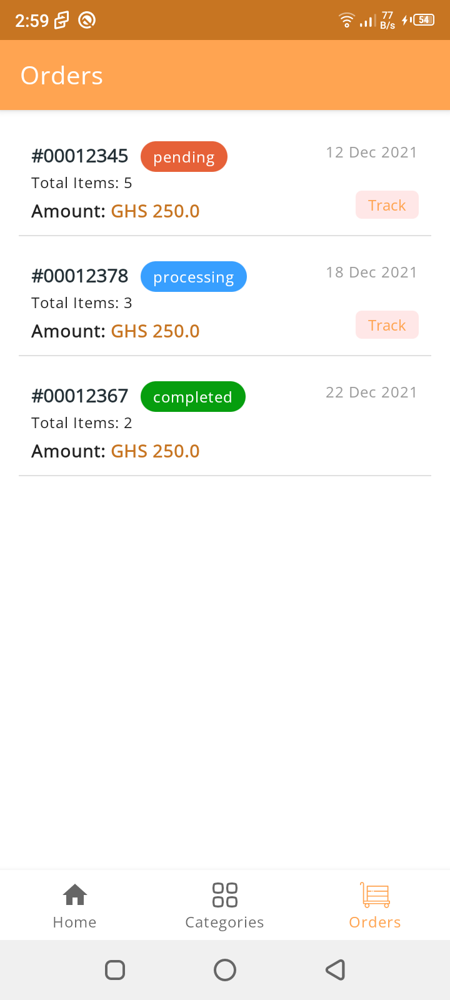
